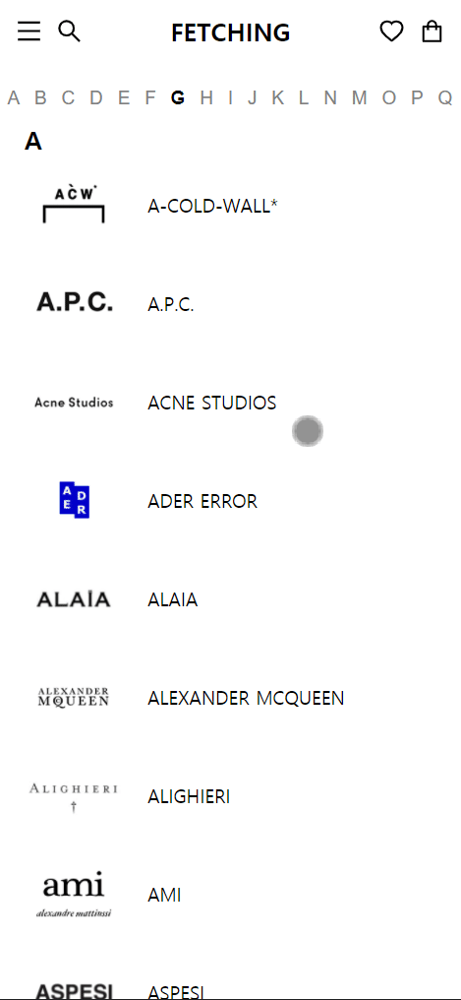

# Fetching 사전 과제 (Demo : [Mail App](https://lee-donghyun.github.io/fetching-frontend-interview/))
---

## 사용 라이브러리
---
- React, Redux, styled-components, @ant-design/icons

## 설명
---
### 1. 상품 목록 페이지 화면 개발(`/productList`)
- 카테고리 대분류 및 소분류 클릭 시 해당 상품 목록들로 렌더.
- 브랜드 및 가격을 필터링해서 상품 리스트를 확인.
- 상품 목록 페이지에서 상품 상세페이지(`/productDetail/:id`) 이동 후 .
  이전 페이지(`/productList`)로 돌아왔을 때 설정한 필터 옵션 및 스크롤 위치가 유지.

#### 예시

### 2. 브랜드 전체 리스트 페이지 화면 개발(`/brands`)
- 브랜드 전체 페이지에서 알파벳 클릭 시 해당 알파벳 브랜드 위치로 스크롤이 이동.

### 예시

### 3. Redux
- redux-thunk를 활용해 비동기 요청 처리

## 목표
- 기본적인 React Component 및 Redux 활용법에 대해 확인.
- 비동기로 실행되는 자바스크립트에서 서버 데이터를 받아 제어할 수 있는지 확인.
- 제시된 기능 및 UI/UX를 고려하여 구현할 수 있는지 확인.
