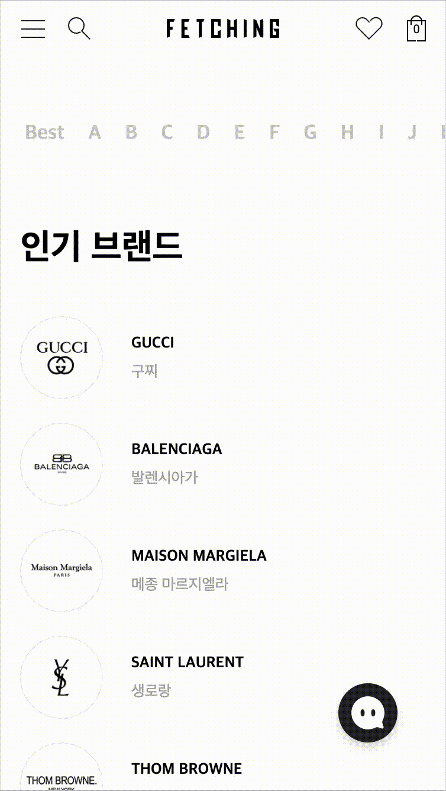

# Fetching 사전 과제
---

## 무엇을 하면 될까요?
---
- UI와 디자인에 제약을 두지 않습니다. 
  실제 상용화된 서비스라 생각하고 최대한 상식적인 웹을 구현해 주세요.
- React, Redux, styled-components를 사용하여 구현해 주세요.
  (필요에 의해 추가적인 라이브러리를 사용하셔도 괜찮습니다.)
- 반응형으로 구현해 주세요.
- 기간: 5일

## TODO
---
### 1.상품 목록 페이지 화면 개발(`/productList`)
- 카테고리 대분류 및 소분류 클릭 시 해당 상품 목록들로 렌더 되어야 합니다.
- 브랜드 및 가격을 필터링해서 상품 리스트를 확인할 수 있습니다.
- 상품 목록 페이지에서 상품 상세페이지(`/productDetail/:id`) 이동 후 
  이전 페이지(`/productList`)로 돌아왔을 때 설정한 필터 옵션 및 스크롤 위치가 유지되어야 합니다.
- 페이지 이동 목적으로 상품 상세 페이지(`/productDetail/:id`) 화면은 구현하지 않으셔도 됩니다.

#### 예시

### 2.브랜드 전체 리스트 페이지 화면 개발(`/brands`)
- 브랜드 전체 페이지에서 알파벳 클릭 시 해당 알파벳 브랜드 위치로 스크롤이 이동되어야 합니다.

### 예시

## API URL
---
- `상품 목록`: https://test.fetchingapp.co.kr/api/items/search  (POST)
  - **parameter**
    - `bookmark`: object (어느 데이터까지 받아 왔는지 알 수 있는 정보)
       - 페이지 네이션 구현 시 다음 데이터를 불러올 때 이전 bookmark를 함께 보냅니다
    - `categoryId`: number (카테고리 ID)
    - `brandIdList`: Array<number> (브랜드 ID 리스트)
    - `minimumPrice`: number (최소 가격)
    - `maximumPrice`: number (최대 가격)
    - `sort`: number (0: 최신순, 1: 할인율, 2: 낮은 가격, 3: 높은 가격)
    - `needCount`: true

- `브랜드`: https://test.fetchingapp.co.kr/api/brands (GET)

- `카테고리`: https://test.fetchingapp.co.kr/api/categories (GET)

## 목표
- 기본적인 React Component 및 Redux 활용법에 대해 확인.
- 비동기로 실행되는 자바스크립트에서 서버 데이터를 받아 제어할 수 있는지 확인.
- 제시된 기능 및 UI/UX를 고려하여 구현할 수 있는지 확인.

## 제출 방법
---
- 리포지토리를 fork 하여 개발한 후, PR을 보내주세요.

## 문의사항
---
- 사전과제를 진행하며 궁금한 점은 아래의 이메일을 통해 문의해 주시기 바랍니다.
- raeyoung.kim@fetching.co.kr
